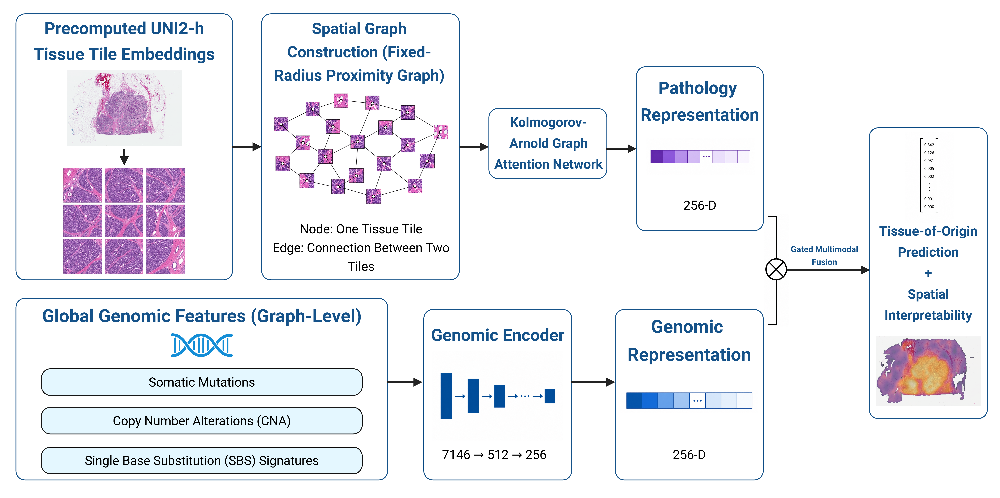

# ATLAS

<p align="center">
  
</p>

ATLAS is a topology-aware multimodal graph learning pipeline for cancer tissue-of-origin prediction that integrates pathology foundation-model embeddings, spatial tissue organization, and somatic genomic features.

The repository includes scripts for genomic feature extraction and filtering, multimodal cohort construction, spatial graph generation, cross-validation splitting, spatial-aware and spatial-null model training, spatial attention visualization, and external validation on CPTAC using five-fold probability averaging.

## Methodology

ATLAS integrates spatial pathology and somatic genomics to predict cancer tissue of origin.

The workflow consists of:

1. **Precomputed UNI2-h tissue tile embeddings**  
   Whole-slide images are represented using `N × 1536` tile-level UNI2-h feature embeddings.

2. **Somatic genomic feature extraction**  
   Mutation, copy-number alteration, and SBS96 mutational-signature features are extracted for each patient.

3. **IntOGen genomic filtering and fusion**  
   Mutation and CNA features are restricted to IntOGen cancer-driver genes, while SBS96 features are retained. The resulting genomic modalities are fused into a patient-level genomic representation.

4. **Matched multimodal cohort construction**  
   Patients with both pathology and genomic data are matched to construct the multimodal TCGA cohort.

5. **ATLAS-specific cross-validation splitting**  
   New site-stratified five-fold train, validation, and test assignments are generated from the matched multimodal cohort.

6. **Spatial graph construction**  
   A fixed-radius proximity graph is built from tissue tile coordinates. Each tissue tile is represented as a node, and edges connect spatially neighboring tissue regions.

7. **Topology-aware multimodal graph learning**  
   Spatial pathology features are processed using a Kolmogorov-Arnold Graph Attention Network, while genomic features are encoded separately and integrated with the pathology representation.

8. **Attention and global mean pooling**  
   Spatial attention pooling and global mean pooling aggregate node-level tissue information into a slide-level pathology representation.

9. **Multimodal representation**  
   The spatial pathology representation is combined with the genomic representation to form an integrated multimodal representation.

10. **Tissue-of-origin prediction**  
    The multimodal representation is used to classify the predicted cancer tissue of origin.

The learned spatial attention weights can also be projected back onto the whole-slide image to provide spatial interpretability.

## Repository Structure

```text
ATLAS/

├── ATLAS.png

├── data/
│   ├── tcga/
│   │   ├── genomics/
│   │   │   └── scripts/
│   │   │       ├── extract_tcga_mutations.py
│   │   │       ├── extract_tcga_cna.py
│   │   │       ├── extract_tcga_sbs96.py
│   │   │       └── fuse_tcga_genomics.py
│   │   │
│   │   ├── multimodal/
│   │   │   └── scripts/
│   │   │       ├── match_tcga_cohort.py
│   │   │       └── create_cv_splits.py
│   │   │
│   │   ├── spatial_aware/
│   │   │   └── build_spatial_aware_graphs.py
│   │   │
│   │   └── spatial_null/
│   │       └── build_spatial_null_graphs.py
│   │
│   └── cptac/
│       ├── genomics/
│       │   └── scripts/
│       │       ├── extract_cptac_mutations.py
│       │       ├── extract_cptac_cna.py
│       │       ├── extract_cptac_sbs96.py
│       │       └── fuse_cptac_genomics.py
│       │
│       └── scripts/
│           └── build_cptac_graphs.py

├── models/
│   ├── spatial_aware/
│   │   ├── figures/
│   │   └── scripts/
│   │       └── train_spatial_aware.py
│   │
│   └── spatial_null/
│       ├── figures/
│       └── scripts/
│           └── train_spatial_null.py

├── interpretability/
│   ├── figures/
│   └── scripts/
│       └── plot_spatial_attention.py

├── validation/
│   └── validate_cptac.py

├── LICENSE
└── README.md
```

## Pipeline

### 1. Extract TCGA Mutation Features

`extract_tcga_mutations.py`

Extracts patient-level somatic mutation features from TCGA mutation data.

### 2. Extract TCGA CNA Features

`extract_tcga_cna.py`

Extracts patient-level copy-number alteration features from TCGA CNA data.

### 3. Extract TCGA SBS96 Features

`extract_tcga_sbs96.py`

Constructs patient-level SBS96 mutational-context features from TCGA somatic mutation data.

### 4. Fuse and Filter TCGA Genomics

`fuse_tcga_genomics.py`

Combines TCGA mutation, CNA, and SBS96 features into a unified patient-level genomic representation.

Mutation and CNA features are restricted to IntOGen cancer-driver genes, while SBS96 features are retained.

The resulting genomic feature schema defines the genomic input used by ATLAS.

### 5. Match the TCGA Multimodal Cohort

`match_tcga_cohort.py`

Matches TCGA patients with available pathology and genomic data to construct the multimodal ATLAS cohort.

The resulting matched cohort defines the patient population used for ATLAS graph construction, cross-validation, and training.

### 6. Create ATLAS Cross-Validation Splits

`create_cv_splits.py`

Creates new ATLAS-specific site-stratified five-fold train, validation, and test splits from the matched multimodal TCGA cohort.

For each outer fold:

- One fold is used as the held-out test set.
- The remaining patients form the training pool.
- An internal validation subset is generated from the training pool.
- The remaining patients are used for training.

The same ATLAS-specific split assignments are used by the spatial-aware and spatial-null training pipelines so their performance can be compared directly.

The script generates:

- `fold_1/split.csv`
- `fold_2/split.csv`
- `fold_3/split.csv`
- `fold_4/split.csv`
- `fold_5/split.csv`
- `fold_summary.csv`
- `site_stratified_outer_folds.csv`
- `split_metadata.json`

### 7. Build TCGA Spatial-Aware Graphs

`build_spatial_aware_graphs.py`

Builds spatial pathology graphs from UNI2-h tile embeddings and tissue tile coordinates.

Each tissue tile is represented as a node, and fixed-radius edges connect spatially neighboring tissue regions.

The graphs preserve the native tissue organization used by the spatial-aware ATLAS model.

### 8. Build Spatial-Null Graphs

`build_spatial_null_graphs.py`

Creates the spatial-null control by permuting tissue tile coordinates within each slide while preserving the same tile embeddings and node count.

The graph is then reconstructed from the shuffled coordinates and the spatial edge attributes are recomputed.

This disrupts native tissue placement and neighborhood relationships while preserving the underlying morphological content.

### 9. Train the Spatial-Aware ATLAS Model

`train_spatial_aware.py`

Trains the multimodal spatial-aware ATLAS model using five-fold cross-validation.

The model integrates:

- UNI2-h pathology embeddings
- Spatial graph topology
- Kolmogorov-Arnold graph attention
- Attention pooling
- Global mean pooling
- IntOGen-filtered mutation features
- IntOGen-filtered CNA features
- SBS96 features

The genomic representation is encoded separately and fused with the spatial pathology representation before tissue-of-origin classification.

The script also generates:

- Training loss curves
- Training accuracy curves
- Validation loss curves
- Validation accuracy curves
- Five-fold model checkpoints
- Combined five-fold confusion matrix

### 10. Train the Spatial-Null Model

`train_spatial_null.py`

Trains the multimodal spatial-null control using the same genomic features, model architecture, training framework, and ATLAS-specific cross-validation splits.

The difference is that the pathology graphs have disrupted spatial organization.

This allows the contribution of native tissue topology to be evaluated while keeping the underlying tile embeddings and genomic information unchanged.

The script also generates:

- Training loss curves
- Training accuracy curves
- Validation loss curves
- Validation accuracy curves
- Five-fold model checkpoints

### 11. Extract CPTAC Mutation Features

`extract_cptac_mutations.py`

Extracts patient-level somatic mutation features from CPTAC data.

### 12. Extract CPTAC CNA Features

`extract_cptac_cna.py`

Extracts patient-level copy-number alteration features from CPTAC data.

### 13. Extract CPTAC SBS96 Features

`extract_cptac_sbs96.py`

Constructs patient-level SBS96 mutational-context features for CPTAC samples.

### 14. Fuse CPTAC Genomics

`fuse_cptac_genomics.py`

Combines CPTAC mutation, CNA, and SBS96 features and aligns them to the exact genomic feature schema used during TCGA ATLAS training.

CPTAC mutation and CNA features are mapped onto the same IntOGen-filtered training feature space.

SBS96 features are aligned to the same training columns.

Features that are absent in CPTAC are assigned zero so that the external-validation genomic representation matches the dimensionality and ordering used during TCGA training.

### 15. Build CPTAC Multimodal Graphs

`build_cptac_graphs.py`

Builds spatial pathology graphs for CPTAC samples and associates each graph with the aligned CPTAC genomic feature vector.

These multimodal CPTAC samples are used only for external validation.

### 16. CPTAC External Validation

`validate_cptac.py`

Loads the five trained spatial-aware ATLAS fold models and evaluates CPTAC samples.

For each CPTAC slide:

1. The slide is evaluated independently by all five fold models.
2. Each model produces a softmax probability vector.
3. The five probability vectors are stacked.
4. The probability vectors are averaged element-wise.
5. The class with the highest averaged probability is used as the final prediction.

For patients with multiple slides, the ensemble slide-level probability vectors are averaged again to produce a patient-level prediction.

CPTAC is used only for external validation and is not used for model training or model selection.

The validation script generates:

- `cptac_failures.json`
- `cptac_slide_predictions.csv`
- `cptac_per_project_metrics.csv`
- `cptac_patient_predictions.csv`
- `cptac_confusion_matrix.csv`
- `cptac_classification_report.json`
- `cptac_summary.json`

### 17. Spatial Attention Visualization

`plot_spatial_attention.py`

Generates spatial attention visualizations for a supplied ATLAS graph, trained model checkpoint, and whole-slide image.

The learned graph-attention weights are projected back onto tissue coordinates to identify spatial tissue regions that contribute most strongly to tissue-of-origin prediction.

## Spatial-Null Analysis

The spatial-null experiment is designed to isolate the contribution of native tissue organization.

Within each sample, tissue tile coordinates are randomly permuted while preserving:

- The same tile embeddings
- The same node count
- The same underlying morphological information

The fixed-radius graph is then rebuilt using the shuffled coordinates, and the spatial edge attributes are recomputed.

This disrupts the original spatial placement and neighborhood relationships while preserving the underlying pathology content.

The spatial-aware and spatial-null models are trained using the same genomic information and the same ATLAS-specific cross-validation assignments.

Comparing their performance therefore measures the added predictive contribution of preserving native spatial tissue organization.

## Multimodal Genomic Representation

ATLAS integrates three genomic feature groups:

- Somatic mutation features
- Copy-number alteration features
- SBS96 mutational-context features

Mutation and CNA features are restricted to IntOGen cancer-driver genes.

SBS96 features are retained as complementary mutational-context information.

The resulting genomic feature vector is encoded independently and then fused with the spatial pathology representation before tissue-of-origin classification.

This enables ATLAS to combine complementary information from tissue morphology, spatial organization, and somatic genomics.

## Cross-Validation

ATLAS uses new site-stratified five-fold cross-validation assignments generated specifically for the matched multimodal TCGA cohort.

The splits are not inherited from the pathology-only NEXUS cohort.

For each of the five outer folds:

- One fold serves as the held-out test set.
- The remaining patients form the training pool.
- An internal validation subset is generated from the training pool.
- The remaining patients are used to fit the model.

Site and tumor-origin distributions are considered when generating the folds.

The spatial-aware and spatial-null models use the same ATLAS-specific train, validation, and test assignments to enable direct comparison.

## External Validation

External validation is performed using CPTAC.

CPTAC mutation, CNA, and SBS96 features are aligned to the genomic feature schema established during TCGA training.

CPTAC spatial graphs are constructed using the same spatial graph framework used for TCGA.

The five independently trained TCGA fold models are then applied to every CPTAC sample.

For each sample, the five softmax probability vectors are averaged element-wise to produce the final prediction.

For patients represented by multiple slides, the slide-level ensemble probability vectors are averaged again to produce a patient-level prediction.

CPTAC is not used for model training, model selection, cross-validation splitting, or hyperparameter optimization.

## Interpretability

ATLAS provides spatial interpretability through learned graph-attention weights.

Attention values can be projected back onto whole-slide tissue coordinates to visualize the tissue regions receiving the highest learned importance.

These spatial attention maps provide a view of the tissue neighborhoods contributing most strongly to tissue-of-origin prediction.

Spatial-aware and spatial-null attention maps can also be compared to assess how disruption of native tissue topology affects learned spatial importance patterns.

## License

This project is licensed under the MIT License. See the [LICENSE](LICENSE) file for details.
